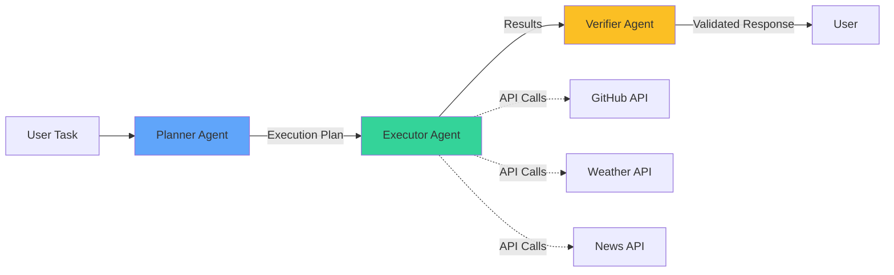

<div align="center">

# 🤖 TaskFlow AI

**An intelligent multi-agent system for executing complex tasks through natural language**

[](https://github.com/immohitsen/taskflow-ai)
[](https://opensource.org/licenses/MIT)
[](https://www.python.org/downloads/)
[](https://fastapi.tiangolo.com)

[Features](#-features) • [Architecture](#-architecture) • [Quick Start](#-quick-start) • [API Documentation](#-api-documentation) • [Examples](#-usage-examples)

</div>

---

## 📋 Overview

TaskFlow AI is a production-ready AI agent system that transforms natural language instructions into actionable tasks. Using a **multi-agent architecture** with specialized roles (Planner, Executor, Verifier), it autonomously plans, executes, and validates complex workflows by orchestrating multiple API integrations.

### What makes TaskFlow AI different?

- 🧠 **Multi-Agent Architecture**: Specialized agents for planning, execution, and verification
- 🔌 **Extensible Tool System**: Modular design for easy integration of new APIs and services
- 🎯 **Type-Safe Operations**: Structured outputs using Pydantic models with Gemini AI
- 🌐 **Production-Ready API**: FastAPI backend with comprehensive error handling
- 💬 **Modern UI**: Beautiful React frontend for interactive task execution
- 🔄 **Real-time Processing**: Streaming responses with detailed execution logging

---

## ✨ Features

### Core Capabilities

- **Natural Language Processing**: Convert conversational requests into structured execution plans
- **Multi-Tool Orchestration**: Seamlessly chain multiple API calls in a single workflow
- **Intelligent Error Recovery**: Automatic retry logic with fallback strategies
- **Structured Validation**: Type-safe outputs with comprehensive result verification
- **Real-time Monitoring**: Track execution progress with detailed logging

### Integrated Tools

| Tool | Provider | Capabilities |
|------|----------|--------------|
| **🔍 GitHub** | GitHub REST API | Repository search, trending projects, developer stats |
| **🌤️ Weather** | WeatherAPI.com | Real-time weather data for 100,000+ cities worldwide |
| **📰 News** | NewsAPI | Latest headlines, article search, topic-based news |

---

## 🏗️ Architecture

TaskFlow AI implements a **three-stage agentic workflow**:



### Agent Responsibilities

| Agent | Role | Key Functions |
|-------|------|---------------|
| **Planner** | Task Analysis | Decomposes user requests into step-by-step execution plans with tool selection |
| **Executor** | Execution Engine | Executes each step sequentially, manages API calls, handles retries |
| **Verifier** | Quality Assurance | Validates completeness, checks data integrity, formats final output |

### Technology Stack

**Backend:**
- **Framework**: FastAPI (async/await support)
- **LLM**: Google Gemini 2.5 Flash (structured outputs)
- **Type Safety**: Pydantic v2
- **HTTP Client**: httpx (async requests)

**Frontend:**
- **Framework**: React 18
- **Build Tool**: Vite
- **Styling**: Tailwind CSS
- **Icons**: Lucide React

---

## 🚀 Quick Start

### Prerequisites

- **Python 3.11+** ([Download](https://www.python.org/downloads/))
- **Node.js 18+** ([Download](https://nodejs.org/)) - for frontend
- API Keys (all free tiers available):
  - [Google Gemini API](https://ai.google.dev/) - LLM processing
  - [WeatherAPI.com](https://www.weatherapi.com/signup.aspx) - Weather data
  - [NewsAPI](https://newsapi.org/register) - News headlines
  - [GitHub Token](https://github.com/settings/tokens) - Optional, increases rate limits

### Installation

#### 1. Clone the Repository

```bash
git clone https://github.com/immohitsen/taskflow-ai.git
cd taskflow-ai
```

#### 2. Backend Setup

```bash
# Create virtual environment
python -m venv venv

# Activate virtual environment
# Windows:
venv\Scripts\activate
# Mac/Linux:
source venv/bin/activate

# Install dependencies
pip install -r requirements.txt
```

#### 3. Configure Environment Variables

```bash
# Copy the example environment file
cp .env.example .env

# Edit .env with your API keys
```

**Required environment variables:**

```env
# LLM Configuration
GEMINI_API_KEY=your_gemini_api_key_here

# Tool API Keys
WEATHER_API_KEY=your_weatherapi_key_here
NEWS_API_KEY=your_newsapi_key_here
GITHUB_TOKEN=your_github_token_here  # Optional but recommended
```

#### 4. Frontend Setup (Optional)

```bash
cd frontend
npm install
```

### Running the Application

#### Start Backend Server

```bash
# From project root
python main.py

# Or with uvicorn:
uvicorn main:app --reload --host 0.0.0.0 --port 8000
```

Backend will be available at:
- **API**: http://localhost:8000
- **Interactive Docs**: http://localhost:8000/docs
- **Health Check**: http://localhost:8000/health

#### Start Frontend (Optional)

```bash
# From frontend directory
npm run dev
```

Frontend will be available at: http://localhost:5173

---

## 📁 Project Structure

```
taskflow-ai/
├── agents/                   # Multi-agent system
│   ├── base_agent.py        # Abstract base class for all agents
│   ├── planner.py           # Task planning and decomposition
│   ├── executor.py          # Tool execution and orchestration
│   └── verifier.py          # Result validation and formatting
│
├── tools/                    # API integrations
│   ├── base_tool.py         # Abstract tool interface
│   ├── github_tool.py       # GitHub API wrapper
│   ├── weather_tool.py      # WeatherAPI.com wrapper
│   └── news_tool.py         # NewsAPI wrapper
│
├── llm/                      # LLM client
│   └── gemini_client.py     # Gemini API with structured outputs
│
├── frontend/                 # React UI
│   ├── src/
│   │   ├── App.jsx          # Main application component
│   │   └── main.jsx         # Entry point
│   ├── package.json
│   └── vite.config.js
│
├── main.py                   # FastAPI application entry point
├── requirements.txt          # Python dependencies
├── .env.example             # Environment variables template
└── README.md                # This file
```

---

## 📚 API Documentation

### Endpoints

#### `POST /task`

Execute a natural language task through the multi-agent system.

**Request Body:**
```json
{
  "task": "Find the top 3 Python web frameworks on GitHub and get the weather in San Francisco"
}
```

**Response:**
```json
{
  "task": "Original task description",
  "status": "success",
  "summary": "Brief summary of results",
  "data": {
    "step_1_github": {
      "repositories": [...]
    },
    "step_2_weather": {
      "city": "San Francisco",
      "temperature": "18°C",
      ...
    }
  },
  "errors": [],
  "plan": {
    "task_summary": "Task breakdown",
    "steps": [...],
    "expected_output": "Description of expected results"
  }
}
```

**Status Codes:**
- `200`: Success
- `400`: Invalid request
- `500`: Internal error
- `503`: Service not initialized

#### `GET /tools`

List all available tools and their capabilities.

**Response:**
```json
{
  "tools": [
    {
      "name": "github",
      "description": "Search and retrieve GitHub repository information",
      "parameters": {...}
    },
    ...
  ]
}
```

#### `GET /health`

Health check endpoint for monitoring.

**Response:**
```json
{
  "status": "healthy",
  "llm_ready": true,
  "tools_count": 3,
  "agents_ready": true
}
```

---

## 💡 Usage Examples

### Command Line (cURL)

#### Example 1: Multi-Tool Request
```bash
curl -X POST http://localhost:8000/task \
  -H "Content-Type: application/json" \
  -d '{
    "task": "Find the top 5 Python repositories on GitHub and tell me the weather in London"
  }'
```

#### Example 2: GitHub Repository Search
```bash
curl -X POST http://localhost:8000/task \
  -H "Content-Type: application/json" \
  -d '{
    "task": "Search for trending machine learning repositories created in the last month"
  }'
```

#### Example 3: Weather Query
```bash
curl -X POST http://localhost:8000/task \
  -H "Content-Type: application/json" \
  -d '{
    "task": "What is the current weather in Tokyo, Paris, and New York?"
  }'
```

#### Example 4: News Aggregation
```bash
curl -X POST http://localhost:8000/task \
  -H "Content-Type: application/json" \
  -d '{
    "task": "Get the latest technology news and headlines about artificial intelligence"
  }'
```

#### Example 5: Complex Workflow
```bash
curl -X POST http://localhost:8000/task \
  -H "Content-Type: application/json" \
  -d '{
    "task": "Find trending AI repositories, get weather in Silicon Valley, and show recent AI news"
  }'
```

### Python SDK (Using requests)

```python
import requests

response = requests.post(
    "http://localhost:8000/task",
    json={"task": "Find popular React libraries and get weather in Seattle"}
)

result = response.json()
print(f"Status: {result['status']}")
print(f"Summary: {result['summary']}")
print(f"Data: {result['data']}")
```

---

## 🔧 Adding Custom Tools

TaskFlow AI's modular architecture makes it easy to add new tools:

### 1. Create Tool Class

```python
# tools/my_custom_tool.py
from typing import Any
import httpx
from .base_tool import BaseTool, ToolResult

class MyCustomTool(BaseTool):
    name = "my_tool"
    description = "Description of what your tool does"
    
    @property
    def parameters_schema(self) -> dict[str, Any]:
        return {
            "type": "object",
            "properties": {
                "param1": {
                    "type": "string",
                    "description": "Parameter description"
                }
            },
            "required": ["param1"]
        }
    
    async def execute(self, **kwargs) -> ToolResult:
        # Your implementation
        return ToolResult(success=True, data={...})
```

### 2. Register Tool

```python
# main.py
from tools import MyCustomTool

# In lifespan function:
tools = [GitHubTool(), WeatherTool(), NewsTool(), MyCustomTool()]
```

---

## 🧪 Testing

```bash
# Run test scripts
python test_weather.py          # Test weather API
python test_direct_weather.py   # Direct weather test
python test_core_logic.py       # Test agent logic
```

---

## ⚙️ Configuration

### Environment Variables

| Variable | Required | Description | Default |
|----------|----------|-------------|---------|
| `GEMINI_API_KEY` | ✅ | Google Gemini API key | - |
| `WEATHER_API_KEY` | ✅ | WeatherAPI.com key | - |
| `NEWS_API_KEY` | ✅ | NewsAPI key | - |
| `GITHUB_TOKEN` | ❌ | GitHub personal access token | - |

### LLM Configuration

Modify `llm/gemini_client.py` to customize:
- Model version (`gemini-2.5-flash` by default)
- Temperature and generation parameters
- Safety settings
- Retry logic

---

## 📊 Performance & Limits

### Rate Limits (Free Tiers)

| Service | Limit | Notes |
|---------|-------|-------|
| **Gemini AI** | 15 RPM | Free tier |
| **WeatherAPI** | 1M calls/month | No rate limit |
| **NewsAPI** | 100 requests/day | Free developer tier |
| **GitHub** | 60 requests/hour | Increases to 5000 with token |

### Response Times

- Simple tasks (1-2 tools): ~2-5 seconds
- Complex tasks (3+ tools): ~5-10 seconds
- Planning overhead: ~1-2 seconds

---

## 🐛 Troubleshooting

### Common Issues

**1. "GEMINI_API_KEY environment variable is required"**
- Ensure `.env` file exists and contains valid API key
- Verify environment is activated

**2. "401 Unauthorized" errors**
- Check API key validity
- Verify key hasn't expired
- Ensure correct key for each service

**3. Rate limit errors**
- Add GitHub token to increase limits
- Implement request throttling
- Consider upgrading API tiers

**4. Module import errors**
- Ensure virtual environment is activated
- Run `pip install -r requirements.txt`
- Check Python version (3.11+)

---

## 🗺️ Roadmap

- [ ] **Parallel Tool Execution** - Execute independent steps concurrently
- [ ] **Caching Layer** - Redis integration for API response caching
- [ ] **Conversation Memory** - Multi-turn conversations with context
- [ ] **Streaming Responses** - Real-time progress updates
- [ ] **More Tools** - Slack, Jira, Email, Database connectors
- [ ] **Authentication** - JWT-based user authentication
- [ ] **Cost Tracking** - Monitor and limit API usage costs
- [ ] **Docker Deployment** - Containerized deployment

---

## 🤝 Contributing

Contributions are welcome! Please feel free to submit a Pull Request.

1. Fork the repository
2. Create your feature branch (`git checkout -b feature/AmazingFeature`)
3. Commit your changes (`git commit -m 'Add some AmazingFeature'`)
4. Push to the branch (`git push origin feature/AmazingFeature`)
5. Open a Pull Request

---

## 📄 License

This project is licensed under the MIT License - see the [LICENSE](LICENSE) file for details.

---

## 🙏 Acknowledgments

- Built with [Google Gemini AI](https://ai.google.dev/)
- Powered by [FastAPI](https://fastapi.tiangolo.com/)
- Weather data from [WeatherAPI.com](https://www.weatherapi.com/)
- News from [NewsAPI](https://newsapi.org/)

---

<div align="center">

**Made with ❤️ by [Mohit Singh](https://github.com/immohitsen)**

If you find this project useful, please consider giving it a ⭐️

[Report Bug](https://github.com/immohitsen/taskflow-ai/issues) • [Request Feature](https://github.com/immohitsen/taskflow-ai/issues)

</div>
